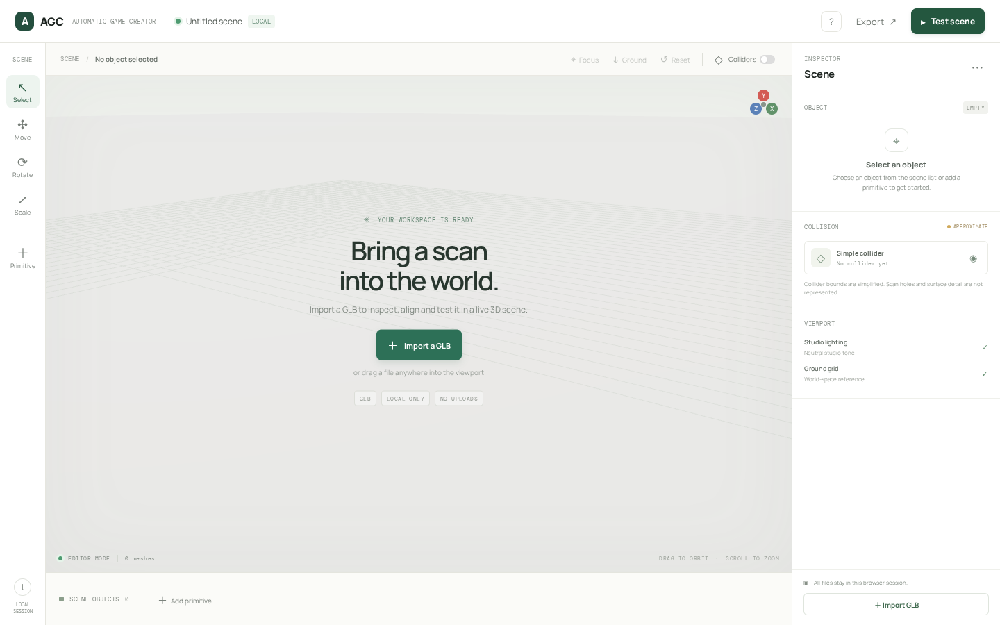
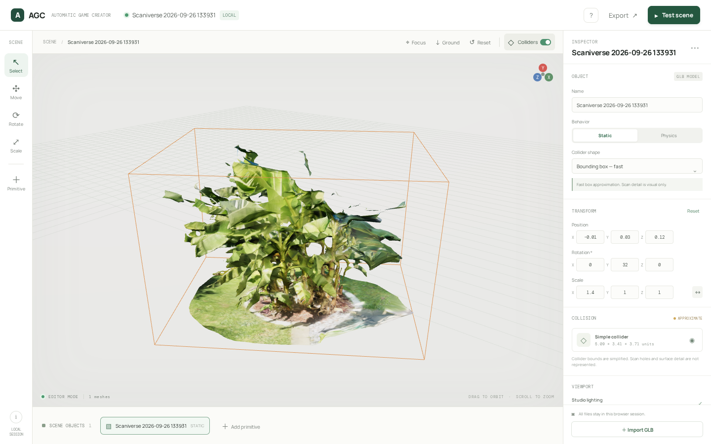
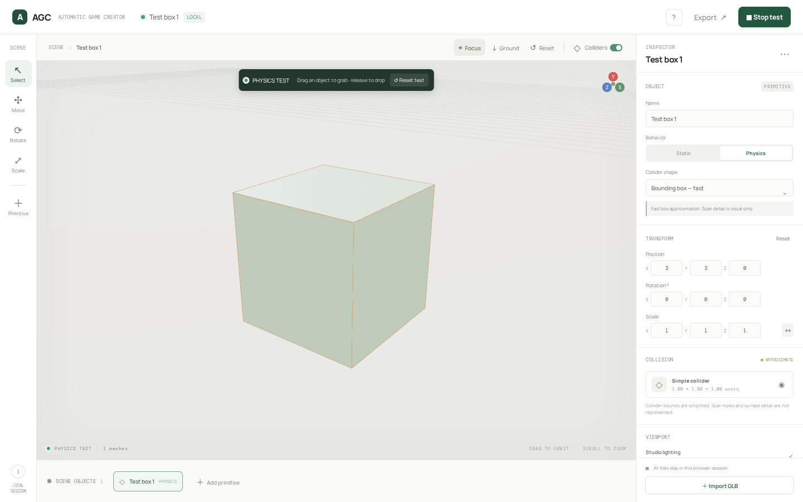

# AGC — Automatic Game Creator

AGC is a local-first browser editor for turning a 3D scan into an object you can inspect, position and try in a small physics scene. The first prototype focuses on a single reliable loop: import a GLB, align it, inspect a simple collider, start a physics test, grab and drop objects, then restore the edited starting scene.

## Run locally

```sh
npm ci
npm run dev -- --host 0.0.0.0
```

Open `/agc/` on the dev server. The Vite build uses `/agc/` as its base path for a future GitHub Pages deployment. `npm run build` verifies the static output; no upload endpoint or AI service is used. Imported files remain in the browser tab and are never sent to a server.

## Controls

- **Import GLB** or drop a `.glb` into the viewport.
- Use Move / Rotate / Scale to edit the selected object's transform. Focus recenters the camera; Ground rests its bounds on the floor; Reset restores its import transform.
- Choose Static or Physics, then **Test scene**. In test mode, click an object and drag it; release to let it fall. **Reset test** restores the exact edited transforms.
- Show collider overlays to inspect the current simplified bounds. Colliders are deliberately coarse boxes; they are not a repaired scan surface or a walkable-surface guarantee.
- The included primitives make repeatable physics checks possible without the private scan.

## Prototype limits

This is an editor MVP, not a game engine. It handles one GLB at a time and uses Three.js rendering plus Cannon.js rigid-body boxes. Complex scan collision is approximated by bounds, including static scans; use the overlay to judge the approximation. GLB material and texture data are preserved by the loader. Source and optimized assets can be compared later; this MVP does not silently downscale the source. WebGL speed depends on the user's GPU and scan complexity.

The user's Scaniverse palm is a local-only test file and is not included in this repository. Do not commit private uploads, derived assets, credentials, browser recordings or runtime data.

## Checks

```sh
npm test
npm run build
```

Playwright tests cover the local editor flow with generated GLBs and primitives. They do not imply mobile-GPU performance or support for every malformed GLB.

## Prototype preview

The checked-in captures show the local-only start screen, the palm scan with its coarse collider, and the primitive physics test:

| Start                                 | Scan + collider                                              | Physics test                               |
| ------------------------------------- | ------------------------------------------------------------ | ------------------------------------------ |
|  |  |  |

The private source GLB is intentionally absent. See [AGC_PROGRESS.md](AGC_PROGRESS.md) for the branch base, test evidence and current limits.
